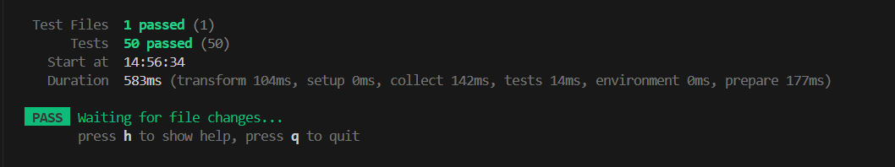

# String Calculator — Incubyte TDD Assessment

This repository contains a solution for the **Incubyte TDD Assessment**, implementing a String Calculator using the **Test-Driven Development (TDD)** approach.

The calculator processes strings containing numbers separated by delimiters and returns their sum, with support for custom delimiters, exception handling, and various edge cases.

---

## 🚀 Features

- Returns `0` for an empty string  
- Supports comma `,` and newline `\n` as default delimiters  
- Allows custom delimiters using `//[delimiter]\n` syntax  
- Supports multi-character delimiters like `//[***]`  
- Supports multiple delimiters like `//[*][%]`  
- Ignores numbers greater than 1000  
- Throws an exception for negative numbers  
- Ignores duplicate numbers during summation  

---

## 📌 Examples

| Input                           | Output or Behavior                                      |
|--------------------------------|----------------------------------------------------------|
| `""`                            | `0`                                                      |
| `"1"`                           | `1`                                                      |
| `"1,2"`                         | `3`                                                      |
| `"1\n2,3"`                      | `6`                                                      |
| `"//;\n1;2"`                    | `3`                                                      |
| `"//[***]\n1***2***3"`          | `6`                                                      |
| `"//[*][%]\n1*2%3"`             | `6`                                                      |
| `"1001,2"`                      | `2` (`1001` is ignored)                                  |
| `"1,-2,3"`                      | ❌ Throws: `negative numbers not allowed: -2`            |

---

## 🧪 Test Scenarios

Step 1: Basic functionality  
Step 2: Handle multiple numbers  
Step 3: Handle new lines between numbers  
Step 4: Support different delimiters  
Step 5: Negative numbers validation  
Step 6: Numbers bigger than 1000 should be ignored  
Step 7: Delimiters can be of any length  
Step 8: Allow multiple delimiters  
Step 9: Multiple delimiters with length longer than one char  
Step 10: Edge cases and boundary conditions  

---

### ✅ All Tests Passed

Below is a screenshot showing all test cases have passed successfully:

---

## 🛠️ Tech Stack

- **Language:** TypeScript  
- **Testing Framework:** Vitest  
- **Approach:** 100% TDD, clean and incremental  

---

## 🙏 Thanks, Incubyte!

Thank you Incubyte for the great learning experience with TDD.
